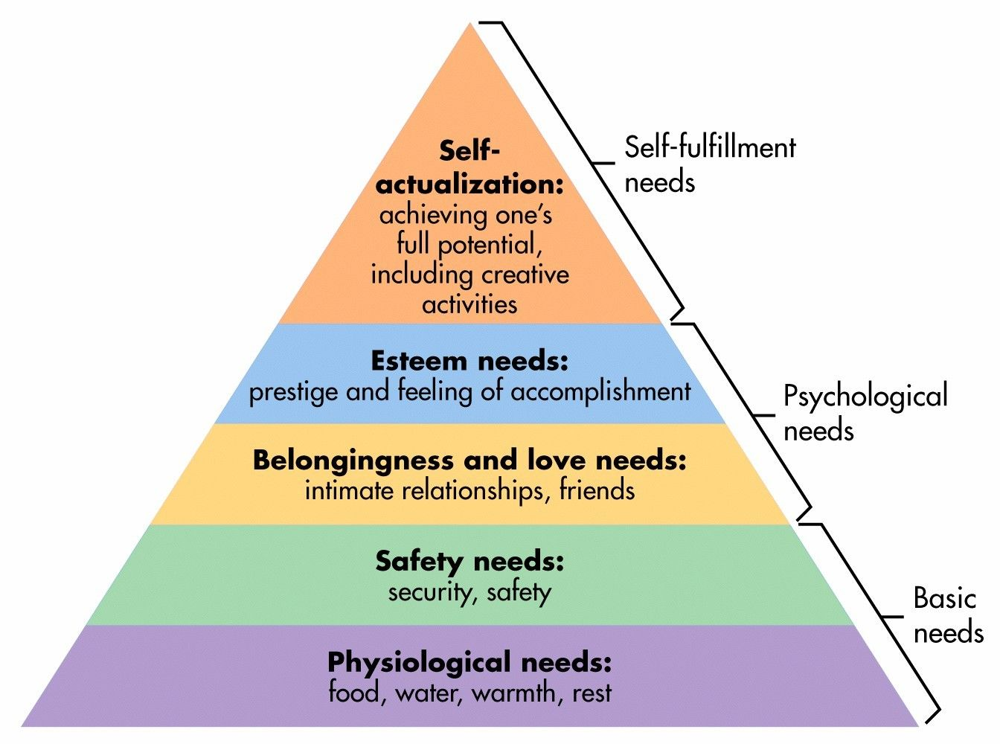
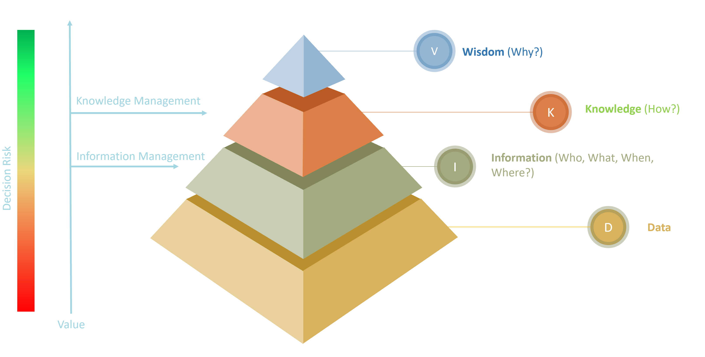

# Knowledge

## Why? 🤔

Why do we want to study and understand knowledge?

Because we can only observe the world from our perspective, our shoes. Knowledge is what allowed our ancestors to survive and eat the things that would not kill us.

**Maslow pyramid**

::: tip
Nowadays in order to survive we need a job and thus (as software engineers) **knowledge of our craft** is what will allow us to cover our physiological needs and **survive**.
:::

## What? 🤓

**DIKW Pyramid**

| Level           | Definition                                                                                                                                                                                                                      | Examples                                                                                                                                                                                                                              |
| --------------- | ------------------------------------------------------------------------------------------------------------------------------------------------------------------------------------------------------------------------------- | ------------------------------------------------------------------------------------------------------------------------------------------------------------------------------------------------------------------------------------- |
| **Noise**       | Physic signal (visual, audible...) not standardized, without pattern.                                                                                                                                                           | _ñlaksjdfk, xxi, k34hsksi29sk2, ]})¿:?({#!!, :-\*, …​, kid clapping, hit the piano keys..._                                                                                                                                           |
| **Data**        | Magnitude of some concrete qualitative or quantitative characteristic, without context or meaning, with a precise. **format**                                                                                                   | _1850, 7009.7 thousands of millions, 9,6%, (, ., !, 8-o,..._                                                                                                                                                                          |
| **Information** | Application of **structured order** over data with the goal of giving them meaning. Information is organized data, related element inside a system structure, describes in a concise **language**                               | _1850 son las retrasmisiones en directo de las campanadas de fin de año que emocionaron al 9,6% de los 7009.7 miles de millones de personas que lo celebramos en 2014 a la vez, decimocuarto aniversario anual dentro del siglo xxi._ |
| **Knowledge**   | **Comprehend** a specific subject, trough experience or education. It builds on top of information to provide context. The key difference between knowledge and information is that knowledge gives us power to make decisions. | _You know how to hang out parties you usually attend_                                                                                                                                                                                 |
| **Wisdom**      | Is the **optimal judgement**, which reflects a deep understanding of people, things, events or situations.                                                                                                                      | _Knows how to enjoy being with others in any party_                                                                                                                                                                                   |

## For what? 😲

## How? 🧐
