# Knowledge

## Why? 🤔

Why do we want to study and understand knowledge?

Because we can only observe the world from our perspective, our shoes. Knowledge is what allowed our ancestors to survive and eat the things that would not kill us.

**Maslow pyramid**

::: tip
Nowadays in order to survive we need a job and thus (as software engineers) **knowledge of our craft** is what will allow us to cover our physiological needs and **survive**.
:::

## What? 🤓

**DIKW Pyramid**

| Level           | Definition                                                                                                                                                                                                                      | Examples                                                                                                                                                                                                                              |
| --------------- | ------------------------------------------------------------------------------------------------------------------------------------------------------------------------------------------------------------------------------- | ------------------------------------------------------------------------------------------------------------------------------------------------------------------------------------------------------------------------------------- |
| **Noise**       | Physic signal (visual, audible...) not standardized, without pattern.                                                                                                                                                           | _ñlaksjdfk, xxi, k34hsksi29sk2, ]})¿:?({#!!, :-\*, …​, kid clapping, hit the piano keys..._                                                                                                                                           |
| **Data**        | Magnitude of some concrete qualitative or quantitative characteristic, without context or meaning, with a precise. **format**                                                                                                   | _1850, 7009.7 thousands of millions, 9,6%, (, ., !, 8-o,..._                                                                                                                                                                          |
| **Information** | Application of **structured order** over data with the goal of giving them meaning. Information is organized data, related element inside a system structure, describes in a concise **language**                               | _1850 son las retrasmisiones en directo de las campanadas de fin de año que emocionaron al 9,6% de los 7009.7 miles de millones de personas que lo celebramos en 2014 a la vez, decimocuarto aniversario anual dentro del siglo xxi._ |
| **Knowledge**   | **Comprehend** a specific subject, trough experience or education. It builds on top of information to provide context. The key difference between knowledge and information is that knowledge gives us power to make decisions. | _You know how to hang out parties you usually attend_                                                                                                                                                                                 |
| **Wisdom**      | Is the **optimal judgement**, which reflects a deep understanding of people, things, events or situations.                                                                                                                      | _Knows how to enjoy being with others in any party_                                                                                                                                                                                   |

## For what? 😲

To obtain **effective** and **efficient solutions** from **complex systems** in any **productive sector**.

In order to exploit all resources in the universe we need to study, investigate, analyze, synthesize and know them.

## How? 🧐

### Sets

| Definition                                                                                     | Concrete                                    |
| ---------------------------------------------------------------------------------------------- | ------------------------------------------- |
| A set is an **unordered collection** of **not repeated elements**, **associated by a pattern** | 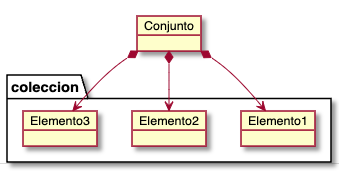                    |
| A **recursive set** is one **whose elements can also be other sets**.                          | 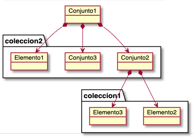 |

#### Objects and Classes

| Objects                                                                                                                                                                                                                                                                      | Classes                                                                                                                                                                                                                                                                                                                                                                                   |
| ---------------------------------------------------------------------------------------------------------------------------------------------------------------------------------------------------------------------------------------------------------------------------- | ----------------------------------------------------------------------------------------------------------------------------------------------------------------------------------------------------------------------------------------------------------------------------------------------------------------------------------------------------------------------------------------- |
| An **object** is a set of elements which are other **objects** which at the same time... **recursively**!                                                                                                                                                                    | A **class** is a set whose elements are the **common characteristics of another set of similar objects**                                                                                                                                                                                                                                                                                  |
| _That peach! The peach I ate; the third peach in the basket, a bit red, that one!_                                                                                                                                                                                           | _Prunus persica, the peach is a deciduous tree first domesticated and cultivated in Zhejiang province of Eastern China..._                                                                                                                                                                                                                                                                |
| @>→---                                                                                                                                                                                                                                                                       | _An emoticon short for "emotion icon", also known simply as an emote, is a pictorial representation of a facial expression using characters—usually punctuation marks, numbers, and letters—to express a person's feelings, mood or reaction, or as a time-saving method_                                                                                                                 |
| A real or virtual being with concrete values in its characteristics                                                                                                                                                                                                          | _A book, a desription, a definition of its common characteristics, without concrete_ values                                                                                                                                                                                                                                                                                               |
| 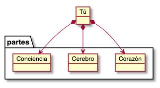                                                                                                                                                                                                                                                     | 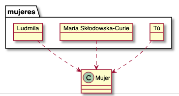                                                                                                                                                                                                                                                                                                                                                              |
| **Focus** on a **set of objects** that **collaborate a lot**, with **high cohesion** and **low coupling**, regardless of their similarity.  _A human body is a set of head, trunk, four extremities --> no similarity_  _A swarm is a group of bees --> similar_ | **Focus** on a **set of common characteristics of a set of objects that are similar**, regardless of whether they **collaborate a lot or not**.  _The Human, they collaborate between them to the point they are kings of the world even though there are other superior species in strength, speed..._  _The service of gas stations, which do not collaborate between them_ |
|                                                                                                                                                                                                                                                      |                                                                                                                                                                                                                                                                                                                                                |
| 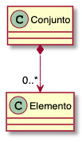                                                                                                                                                                                                                                          | 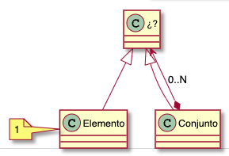                                                                                                                                                                                                                                                                                                                              |

#### Abstract classes

An abstract class is the intersection set of common characteristics from a set of similar classes.

- Living being
  - Plants
  - Fungi
  - Animals
    - Invertebrates
    - Vertebrates
      - Fishes
      - Mammals
        - Canines
        - Felines
        - Primates
          - Monkeys
          - Humans

#### Composition vs Classification Hierarchies

| Composition Hierarchy                                                                                        | Classification Hierarchy                                                                                                                                    |
| ------------------------------------------------------------------------------------------------------------ | ----------------------------------------------------------------------------------------------------------------------------------------------------------- |
| Emerges from the **union of the object parts of a whole** that is as well part of a whole that is as well... | Emerges from the **intersection of the characteristics of similar classes** that at the same time descends from another base class that at the same time... |
| 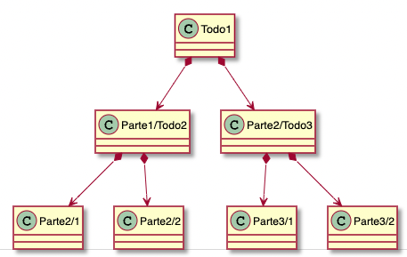                                                           | 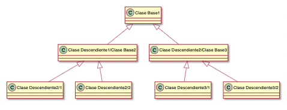                                                                                                    |
| A part is an element of the whole and is the whole for other parts                                           | A derived class is an specialization of the base class and is the base of other specializations                                                             |
| Example: You are the set of organs that each one is a set of tissue which is a set of cells...               | Example: People is the union of the set of men and women with their general, common and shared characteristics                                              |

#### Aggregation vs Multiple Classification Hierarchies

| Aggregation Hierarchy                                                    | Multiple Classification Hierarchy                                         |
| ------------------------------------------------------------------------ | ------------------------------------------------------------------------- |
| A part object belongs to many whole objects                              | A derived class shares characteristics with many base classes             |
| 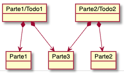                       | 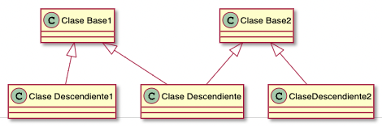 |
| I belong to the family I was raised in and the one I created when I grew | My cousin is Spanish and French, double nationality                       |
|                                                                          |                                                                           |

#### Association relationship

Sets do not have order but can be created from itself, order is an **emergent characteristic**!

- From nothing to quantic matter
- From matter to life in DNA, self-replicable
- From noise to data by collaboration
- From data to information by association
- From life to intelligence by neural networks
- From intelligence to conscience by the free will?

Ordered Pair (a,b), a --> b, ...

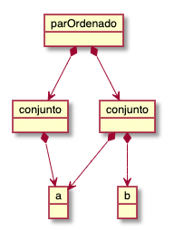

#### Objects structures

##### Sequence

Conditions:

- 0..1 previous elements (0 for the **first** element)
- 0..1 next elements (0 for the **last** element)

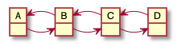

---

##### Tree

Conditions:

- 0..1 previous elements (0 for the **root** element)
- 0..N next elements (0 for the **last** elements)

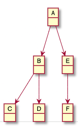

---

##### Graph

Conditions:

- 0..N previous elements (0 or N for any element)
- 0..N next elements (0 or N for any element)

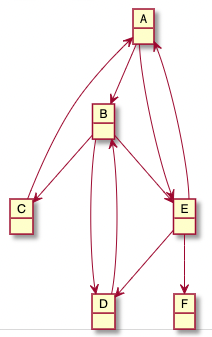

---

##### Hierarchy

Conditions:

- 0..N previous elements (0 or N for any element)
- 0..N next elements (0 or N for any element)
- **Without cycles**

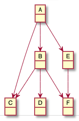

### Classification strategies
