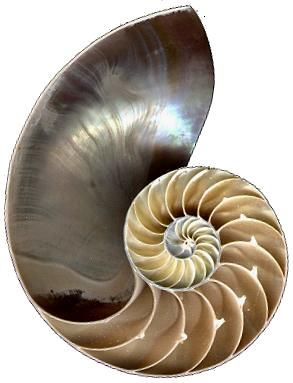
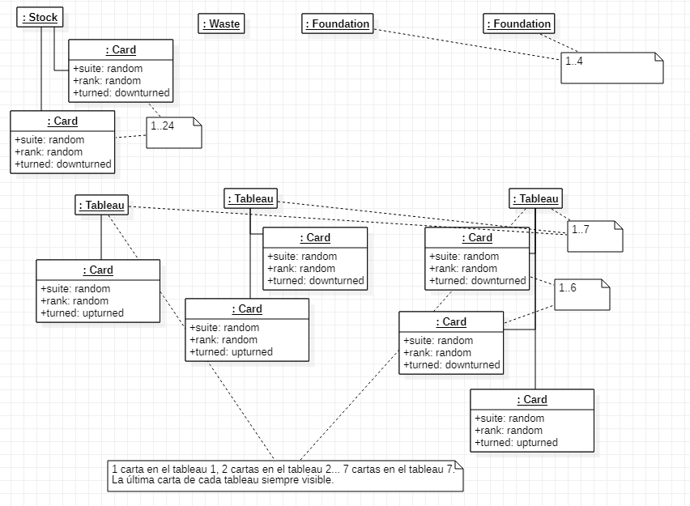
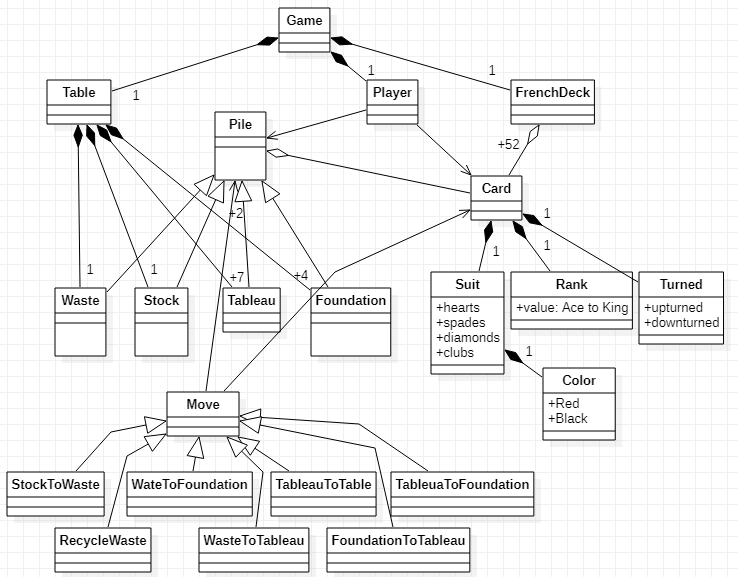
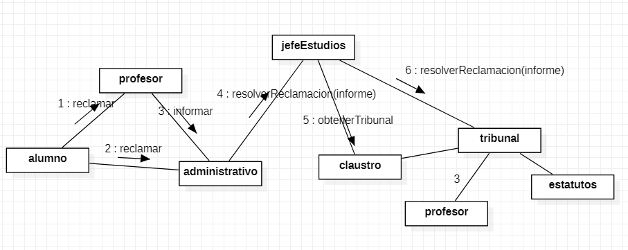

# Patterns

## Why?

Why do we care about patterns?

### Universe

In the space and time there is matter and energy.

[Universe](./assets/universo.svg): _Diagram of the universe objects and classes_

### Senses

Where existing living beings have the ability to perceive **external and internal physical stimulations** through certain **organs** that are passed to our **nervous system**:

- **sight**
- **hearing**
- smell
- taste
- touch

**Physical signals** that can **vary in their frequency, width**, ... and transform in **different color values** decomposed into combinations of red, green and blue or **different values of words** decomposed into phonemes, a, ae, e, i, o , u, ... depending on the language.

_Light spectrum_

### Measurement units

_Basic units_

| Physics                       | Other areas                                |
| ----------------------------- | ------------------------------------------ |
| **International Unit System** | **Economic system, Educational System...** |
| Time: second                  | Music: Pulse                               |
| Length: meter                 | Education: subject                         |
| Mass: kilogram                | Money euro, dollar                         |

_Derived units_

| Physics                            | Other areas                                |
| ---------------------------------- | ------------------------------------------ |
| **International Unit System**      | **Economic system, Educational System...** |
| Force: newton (mass\*length/time2) | Music: Compass                             |
| ...                                | Maths: complex number, vector...           |

_Names_

| Physics                       | Other areas                                |
| ----------------------------- | ------------------------------------------ |
| **International Unit System** | **Economic system, Educational System...** |
| Multiples: kilometer          | Music: Salsa, trap...                      |
| Time: year, month, week       | Education: graduated                       |
| Distance: light year          | Computer science: kilobyte, petabyte...    |

_Relations_

| Value                    | Roman        | Decimal | Binary |
| ------------------------ | ------------ | ------- | ------ |
| 0                        | Non existent | 0       | 0      |
| next(0)                  | I            | 1       | 1      |
| next( next(0))           | II           | 2       | 10     |
| ...                      | ...          | ...     | ...    |
| next( next( next(0)))... | XII          | 12      | 1100   |
| ...                      | ...          | ...     | ...    |

## What?

What is a pattern?

> Pattern, model that is used to get an equal thing

Pattern for an artisan and in industry:

Pattern in science:

### Equality

| Body/Entity                       | Identity                                                                    |
| --------------------------------- | --------------------------------------------------------------------------- |
| What it is, exists or can exist   | Set of characteristics that differentiates something or someone from others |
| What makes something's essence be | Conscience that someone or a group has to be their own and not other        |

| Equal                                                                               | Context                                                                       |
| ----------------------------------------------------------------------------------- | ----------------------------------------------------------------------------- |
| That has the same characteristics of another person or thing in some or all aspects | Precision: necessary to provide the grade of precision when comparing quality |
| Of the same class or condition                                                      | Identifier: people's names or nicknames, concepts, my first child...          |
| Of the same value or preciousness                                                   |                                                                               |

## For what?

For what do we need patterns?

**To be able to, from the present, study the past and predict/imagine the future.**

## How?

How are patterns? How do we find them in our universe?

### Pattern types

#### Recurrent

It will eventually repeat. Example of recurrent pattern would be the rain. You don't know when but it will eventually rain at some point.

#### Iterative

It repeats, the end of one iteration directly connects with the beginning of a new one. Example of an iterative pattern would be day and night.

#### Recursive

It repeats in itself. You can amplify or reduce its point of view and it will replicate the same structure.

### Recursion everywhere

We can find examples of recursion in nature

_Caracola_

_Brocoli_

In our daily life
::: v-pre
`<Insert image here>`
:::

In art
::: v-pre
`<Insert image here>`
:::

## Simple Patterns

| <BlueText text="Line"/>     | <GreenText text="Three points"/>    | <RedText text="Circle"/>        |
| --------------------------- | ----------------------------------- | ------------------------------- |
|  |  |  |
| Sequence                    | Alternation                         | Circularity                     |

## Patterns in software

### Data types

| <BlueText text="Line"/> | <GreenText text="Three points"/> | <RedText text="Circle"/>                  |
| ----------------------- | -------------------------------- | ----------------------------------------- |
| Class                   | Inheritance, composition, union  | Circular dependencies, circular relations |

### Data structures

| <BlueText text="Line"/> | <GreenText text="Three points"/> | <RedText text="Circle"/> |
| ----------------------- | -------------------------------- | ------------------------ |
| List                    | Tree, Hierarchy                  | Graph                    |

### Flow control sentences

| <BlueText text="Line"/>                            | <GreenText text="Three points"/>                    | <RedText text="Circle"/>                            |
| -------------------------------------------------- | --------------------------------------------------- | --------------------------------------------------- |
| Sequential sentence                                | Alternant sentence                                  | Iterative sentence                                  |
| <!--@include: ./prettier-ignore/SequenceCode.md--> | <!--@include: ./prettier-ignore/AlternantCode.md--> | <!--@include: ./prettier-ignore/IterativeCode.md--> |

### Development methodologies

| <BlueText text="Line"/>              | <GreenText text="Three points"/>            | <RedText text="Circle"/>     |
| ------------------------------------ | ------------------------------------------- | ---------------------------- |
| <BlueText text="Waterfall"/>         | <GreenText text="Crystal Clear"/>           | <RedText text="Iteratives"/> |
|  |  |        |

## Domain model

The **domain model** describes the **most important concepts (types of objects)** of a context, things like objects from the domain and the relations between them.

- **Business objects** that represent things that are manipulated by the business.
- **Real world objects and concepts** which a system has to keep track of.
- **Events** that will or have already occur.

With the objective of

- **Comprehend the structure and dynamics** of the organization in which the system will be developed.
- **Comprehend the latest problems** of the target organization.
- Ensure that **clients**, **final users** and **developers** have a **common comprehension** of the target organization.
- Obtain the **requirements** of the system to help the target organization.

::: danger
**Never** talk about the **system's software**! Don't mention words like view, validator, etc.
:::

### Unified Model Language

The usage of **UML** (Unified Model Language) is recommended to model the domain. **RUP** (Rational Unified Process) already does so.

Each symbol (**lexical**) related (**syntax**) in a diagram has a standard meaning (**semantics**). We avoid **ambiguity** and different people interpret the same from the same diagram, opposed to non standardized arrows and boxes.

#### Structural diagrams

| <RedText text="Objects diagram"/>                           | <GreenText text="Classes diagram"/>                                      |
| ----------------------------------------------------------- | ------------------------------------------------------------------------ |
| <RedText text="Picture (static) of entities from reality"/> | <GreenText text="Picture (static) of classes of entities from reality"/> |
|             |                          |
| <RedText text="Barely used"/>                               | <GreenText text="Extremely used"/>                                       |

#### Behavioral diagrams

| <RedText text="Activity diagram"/>                                     | <GreenText text="State diagram"/>                                                                            |
| ---------------------------------------------------------------------- | ------------------------------------------------------------------------------------------------------------ |
| <RedText text="Video (dynamic) with sequence of highlighted actions"/> | <GreenText text="Video (dynamic) with sequence of NOT highlighted actions, highlighting in-between states"/> |
|                       |                                                               |
| <RedText text="Barely used"/>                                          | <GreenText text="Extremely used"/>                                                                           |

| <RedText text="Sequence diagram"/>                                                         | <GreenText text="Collaboration diagram"/>                                                        |
| ------------------------------------------------------------------------------------------ | ------------------------------------------------------------------------------------------------ |
| <RedText text="Video (dynamic) with sequence of actions between different collaborators"/> | <GreenText text="Picture (static) without sequence of actions between different collaborators"/> |
|                                           |                                         |
| <RedText text="Barely used"/>                                                              | <GreenText text="Extremely used"/>                                                               |

#### Domain Model conclusions

- **Comprehend the context of a system** with crucial knowledge of use cases.
- Define a **common vocabulary** for users, clients, developers and others involved.
  - **Glossary of keywords**.
  - **Consistent mix of all participants' language**.
  - **Suggest internal classes** during analysis.
