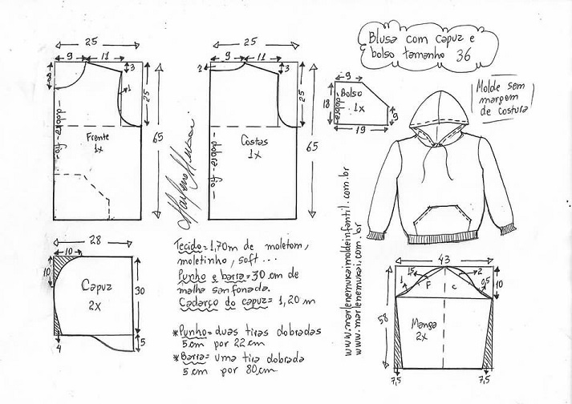

# Patterns

## Why?

### Universe

In the space and time there is matter and energy.

[Universe](./assets/universo.svg): _Diagram of the universe objects and classes_

### Senses

Where existing living beings have the ability to percieve **external and internal fisical stimulations** through certain **organs** that are passed to our **nervous system**:

- **sight**
- **hearing**
- smell
- taste
- touch

**Fisical signals** that can **vary in their frequency, width**, ... and transform in **different color values** decomposed into combinations of red, green and blue or **different values of words** decomposed into fonems, a, ae, e, i, o , u, ... depending on the language.

_Light spectrum_

### Measurement units

_Basic units_

| Physics                       | Other areas                                |
| ----------------------------- | ------------------------------------------ |
| **International Unit System** | **Economic system, Educational System...** |
| Time: second                  | Music: Pulse                               |
| Length: meter                 | Education: subject                         |
| Mass: kilogram                | Money euro, dollar                         |

_Derived units_

| Physics                            | Other areas                                |
| ---------------------------------- | ------------------------------------------ |
| **International Unit System**      | **Economic system, Educational System...** |
| Force: newton (mass\*length/time2) | Music: Compass                             |
| ...                                | Maths: complex number, vector...           |

_Names_

| Physics                       | Other areas                                |
| ----------------------------- | ------------------------------------------ |
| **International Unit System** | **Economic system, Educational System...** |
| Multiples: kilometer          | Music: Salsa, trap...                      |
| Time: year, month, week       | Education: graduated                       |
| Distance: light year          | Computer science: kilobyte, petabyte...    |

_Relations_

| Value                    | Roman        | Decimal | Binary |
| ------------------------ | ------------ | ------- | ------ |
| 0                        | Non existant | 0       | 0      |
| next(0)                  | I            | 1       | 1      |
| next( next(0))           | II           | 2       | 10     |
| ...                      | ...          | ...     | ...    |
| next( next( next(0)))... | XII          | 12      | 1100   |
| ...                      | ...          | ...     | ...    |

## What?

What is a pattern?

> Pattern, model that is used to get an equal thing

Pattern for an artisan and in industry:

Pattern in science:

### Equality

| Body/Entity                       | Identity                                                                    |
| --------------------------------- | --------------------------------------------------------------------------- |
| What it is, exists or can exist   | Set of characteristics that differentiates something or someone from others |
| What makes something's essence be | Consience that someone or a group has to be their own and not other         |

| Equal                                                                               | Context                                                                       |
| ----------------------------------------------------------------------------------- | ----------------------------------------------------------------------------- |
| That has the same characteristics of another person or thing in some or all aspects | Precision: necessary to provide the grade of precision when comparing quality |
| Of the same class or condition                                                      | Identifier: people's names or nicknames, concepts, my first child...          |
| Of the same value or preciousnes                                                    |                                                                               |

## For what?

For what do we need patterns?

**To be able from the present, study the past and predict/imagine the future.**

## How?

### Pattern types

#### Recurrent

It will eventually repeat. Example of recurrent pattern would be the rain. You dont know when but it will eventually rain at some point.

#### Iterative

It repeats, the end of one iteration directly connects with the beginning of a new one. Example of an iterative pattern would be day and night.

#### Recurrsive

It repeats in itself. You can amplify or reduce its point of view and it will replicate the same structure.

### Recursivity everywhere

We can find examples of recursivity in nature

_Caracola_

_Brocoli_

In our daily life
::: v-pre
`<Insert image here>`
:::

In art
::: v-pre
`<Insert image here>`
:::

## Simple Patterns

| <ColoredText text="Line" color="blue"/> | <ColoredText text="Three points" color="green"/> | <ColoredText text="Circle" color="red"/> |
| --------------------------------------- | ------------------------------------------------ | ---------------------------------------- |
|              |               |           |
| Sequence                                | Alternance                                       | Circularity                              |

## Patterns in software

### Data types

| <ColoredText text="Line" color="blue"/> | <ColoredText text="Three points" color="green"/> | <ColoredText text="Circle" color="red"/>  |
| --------------------------------------- | ------------------------------------------------ | ----------------------------------------- |
| Class                                   | Inheritance, composition, union                  | Circular dependencies, circular relations |

### Data structures

| <ColoredText text="Line" color="blue"/> | <ColoredText text="Three points" color="green"/> | <ColoredText text="Circle" color="red"/> |
| --------------------------------------- | ------------------------------------------------ | ---------------------------------------- |
| List                                    | Tree, Hierarchy                                  | Graph                                    |

### Flow control sentences

| <ColoredText text="Line" color="blue"/>       | <ColoredText text="Three points" color="green"/> | <ColoredText text="Circle" color="red"/>                             |
| --------------------------------------------- | ------------------------------------------------ | -------------------------------------------------------------------- |
| Sequencial sentence                           | Alternative sentence                             | Iterative sentence                                                   |
| <!--@include: ./components/SequenceCode.md--> | <!--@include: ./components/AlternanceCode.md-->  | `while (x>0){ ...}do { ...} while(x>0);for(int i=0; i<0; i++){ ...}` |
